# Intro To Physical Computing With Arduino
### James Hosken and Brent Bailey
### Heavily indebted to [ITP’s Physical Computing Syllabus](https://itp.nyu.edu/physcomp/)

## What’s The Deal With Physical Computing?

Pretty much any electronic interface you can think of involves physical computing. Computers? Physical computing (sometimes). [The clapper?](https://www.youtube.com/watch?v=Ny8-G8EoWOw) Physical computing. But physical computing is a specific school of thought around interface design.

Physical computing is the design of interfaces that take the human body as a starting point, instead of starting from the hardware and form restrictions of a computer alone.

Physical computing involves a lot of hands-on work: making circuits, incorporating components, fabricating structures, and writing the code to make it all work.

In the context of this brief introduction, we’ll be covering some basic concepts in electronics, and explaining some basic theory and practice behind using microcontrollers on the electronic circuits we build. We’ll be building an extremely simple circuit, but taking as much time as possible to understand what’s actually happening. This is a chance to dip your toe into the deep, deep waters of physical computing: if you fall in love with it, there’s a lifetime’s worth of things to do and learn.

## Basics of Electricity: voltage, current, and resistance

**Electricity** is the flow of electrical energy through conductive materials. Electrical circuits - the basic objects you’re working with in any form of physical computing - are the combination of a power source, which provides electricity, and components that convert that energy into other forms, like visual output on a screen, or a motor turning.

- **Voltage** is a measure of the difference in electrical potential energy between two points in a circuit-  we can think of it as kind of a measure of the raw energy available. It’s measured in Volts.
  - An important thing for us to remember is that the voltage across our circuit is determined by the power supply (e.g. an Arduino provides 5V). We need to use components that can handle that.

- **Current** is a measure of the rate at which electrical energy is flowing. It’s measured in Amperes, or Amps.
  - An important thing for us to remember is that components will try to *draw* as much current as they can, and different power supplies can deliver only so much current. Bigger current components require bigger power supplies.

- **Resistance** is a measure of a material’s ability to resist the flow of current. It’s measured in Ohms. Every object has some degree of resistance, but when we’re building circuits, we generally use materials that are super-low resistance, like copper wire, to carry the current through it.

In the context of a circuit, our electrical energy begins and ends at a power supply, which usually has two ends: **Power** and **Ground**. Power is where our voltage and current come from, and ground is where it ends. Electrical current is kind of like a waterfall: it flows from places of high potential energy to low potential energy. We can think of our voltage as the height of the waterfall, current as the amount of water flowing through it, and resistance as anything that might get in the way of that flow. In this analogy, the Ground is, well, the ground. The Ground is the place in a circuit where the potential energy of the electrons is zero: it provides a safe path for the electricity to flow to. It’s also a reference point without which we cannot measure voltage and current correctly - since voltage is the potential energy between two points, at some point we need a zero-voltage point to measure our beginning voltage correctly.  In a low-voltage system like an Arduino or a battery, it’s usually part of the power supply, but its name comes from higher-voltage systems where the ground is often the actual earth itself.

Since this is a hands-on workshop, we won’t go too in-depth into electrical theory here, but here are a few useful resources for those inclined:

- [Sparkfun’s Electricity Tutorials](https://learn.sparkfun.com/tutorials/voltage-current-resistance-and-ohms-law/all)
- [ITP’s Electricity: the Basics](https://itp.nyu.edu/physcomp/lessons/electronics/electricity-the-basics/)

## How do we measure these?

With our handy multimeters, of course!

Let’s set up a simple power supply using our Arduinos. For this section of the course, we’ll be treating our Arduinos exclusively as a power supply, so don’t worry about the complexities of microcontrollers or having to write code. We’ll get to (very basic) information on that in the next section.

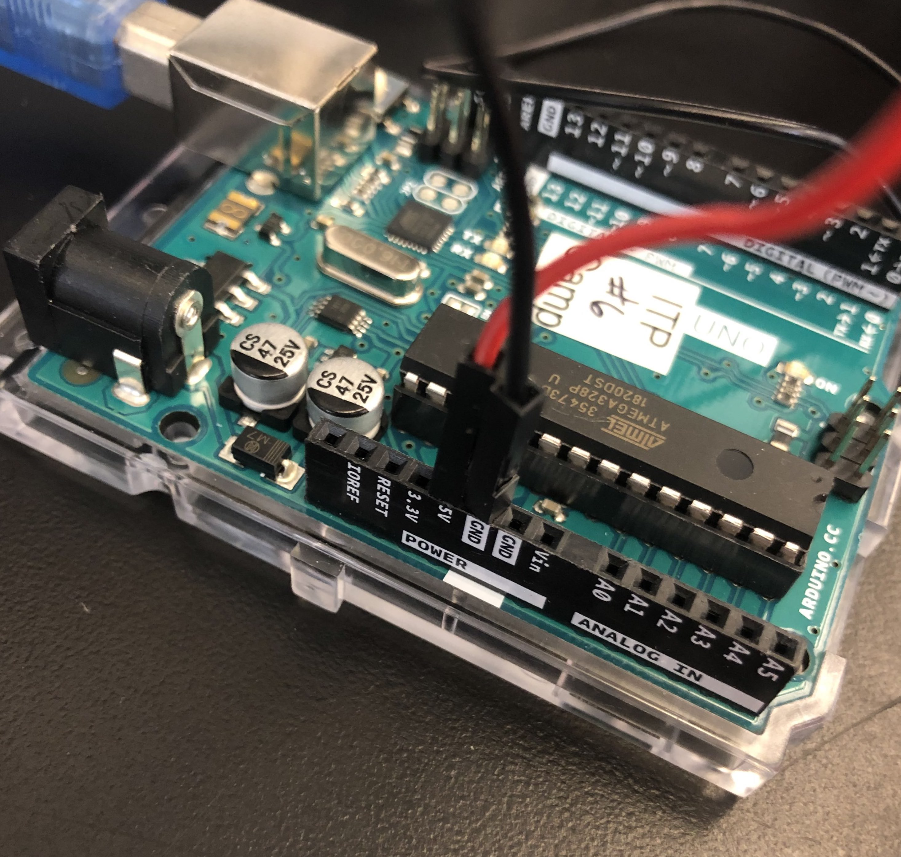
Plug a black wire into the hole on your Arduino that says `GND`, and a red wire into the hole above it that says `5V`. Let’s do a test measurement to make sure our Arduinos are working correctly.

If you have alligator clips, clip them between the red and black wires on the Arduino and the red and black wires on the multimeter. The black wire to the multimeter should be plugged into the COM port, and the red wire should be plugged into the port on the right - the other port is for super high current measurements, which we won’t be doing today.

**SIDE NOTE:** *Conventionally red is used to indicate a 5V line from power, and black is used to indicate a wire going to ground. We will stick to this convention.*

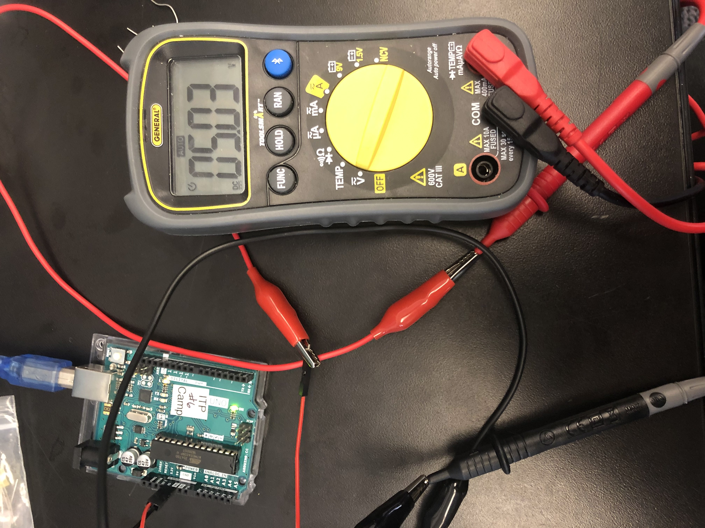

First, turn your multimeter to the “V” symbol. We should get an output around 5 volts, since we’re attached to the 5V port.

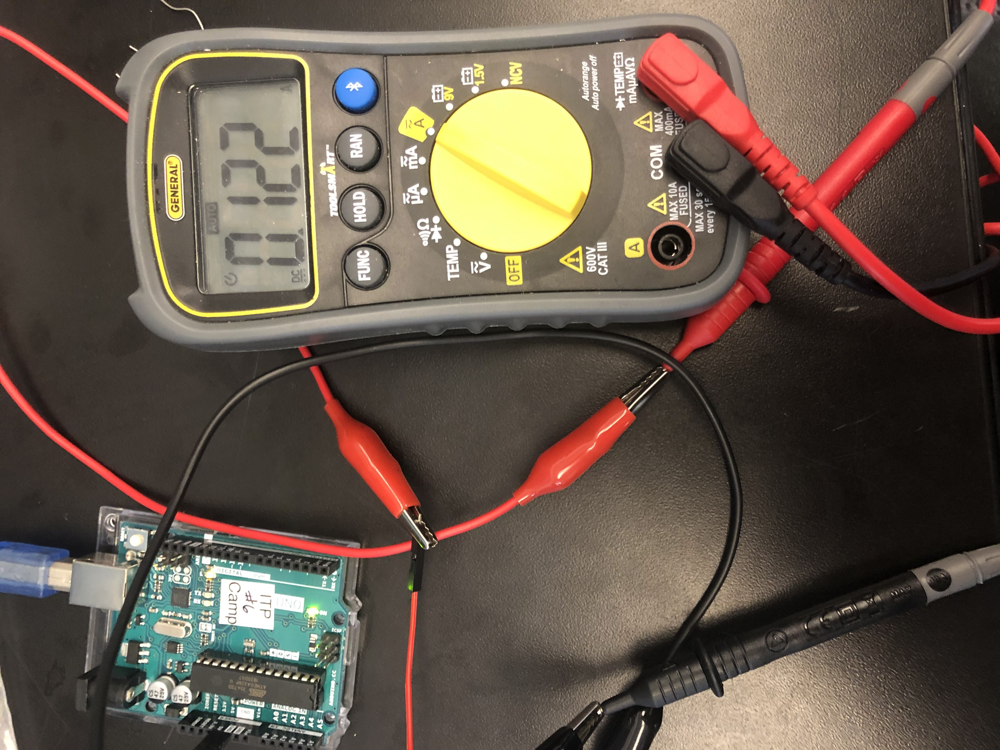

Now, turn your multimeter to the “A” symbol. We should get an output around .125 amps.

You can plug your multimeter in at just about any point in a circuit (making sure to put your power cable closer to the power source) to determine the voltage and current available at those points. This is an easy way to debug why something might not be working: if it’s not getting any voltage or current, that’s probably why!

**SIDE NOTE:** *This is the simplest form of measurement; measuring across an open power supply. When you measure different sections of your circuit the processes for measuring voltage and current are slightly different, so be sure to familiarise yourself with the differences below. In general, voltage is measured across a component and current is measured before a component.*

To get more familiar with a multimeter and some of the rules around electronics, you can check out [ITP’s Electronics Lab](https://itp.nyu.edu/physcomp/labs/labs-electronics/electronics/).

## Simple Circuits

Now, let’s break out our breadboards.

### What’s a breadboard?

Basically, a breadboard is a device designed to help prototype circuits without needing to solder. They come in different shapes and sizes, but in general, they consist of two large pieces of wire running down each side, and then a bunch of smaller pieces of wire running perpendicularly along.
 

The two large pieces of wire are usually called **power rails**: this is where we usually connect our power source to the breadboards. The smaller pieces are used to connect components to the power supply.

**Side note:** The letters on numbers on some breadboards don’t actually mean anything! They can be useful if you want to clearly diagram out locations for different components, but in general all you need to worry about is that the flow of current on the power rails is vertical and on the component pieces is horizontal, and make sure your circuit keeps current flowing through it at every point.

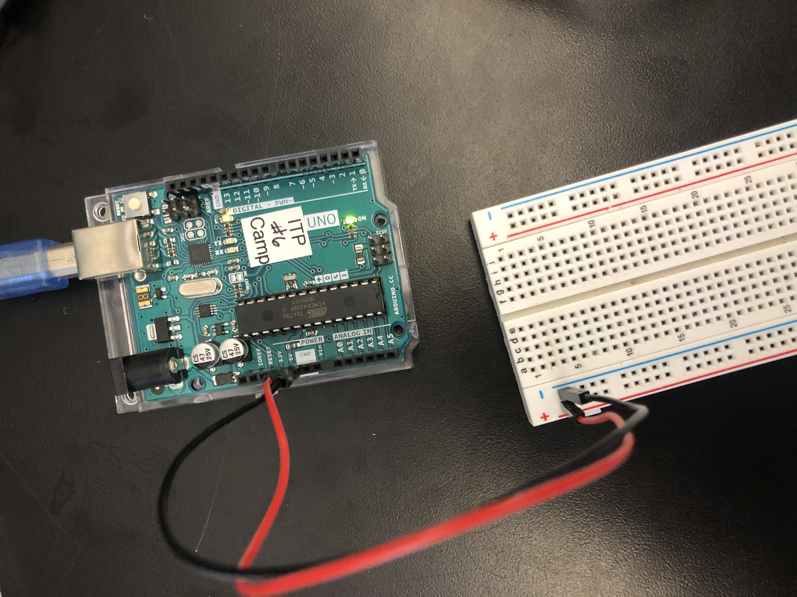

Let’s connect the ground wire (the black wire connected to GND on the Arduino) to one of the blue rails on the side of our breadboard, then connect power (the red wire connected to 5V).

**IMPORTANT SIDE NOTE:** *When adding or removing components from a breadboard, always **unplug your power supply first**!*

### Adding an LED

#### What’s an LED?

An LED is a type of diode: a component that is **polarized**: this means it allows the flow of electricity in one direction, and blocks it in the other.
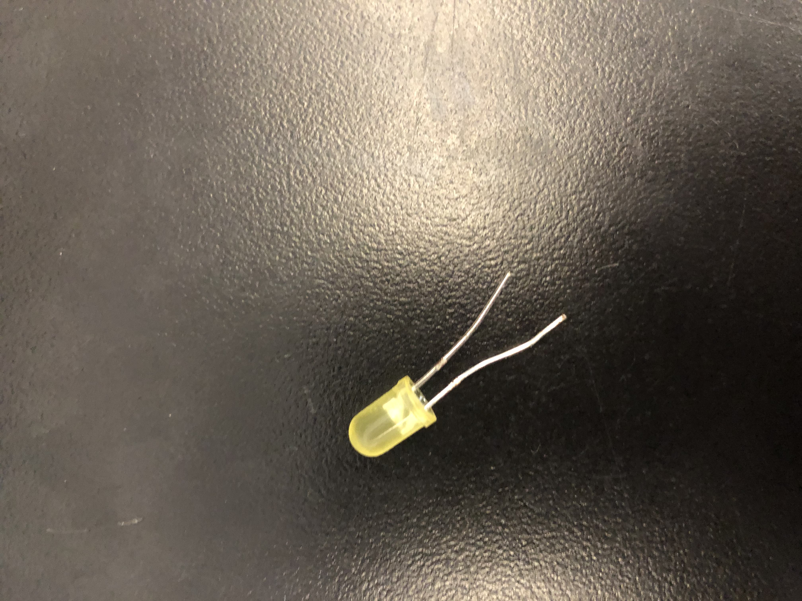
An **LED** (light-emitting diode) is a special type of diode that emits light when current flows through it: with LEDs, you can generally tell which side current flows through by the length of its legs: the longer leg is the one the power should enter, and the shorter is the one it should leave.

**SIDE NOTE:** If your LED has equal sized legs, look for a flat section on the rim. That side should point to ground.

An LED is one of the simplest and most common types of **actuators**: the components that turn our electrical energy into some other form of energy. In this case, it’s turning it into light.

Now that we know how current flows through an LED, and through a breadboard, let’s try making the simplest circuit possible: put the short leg of your LED into the blue rail on your breadboard (remember to always ground your component first!), then the long leg into the red rail.

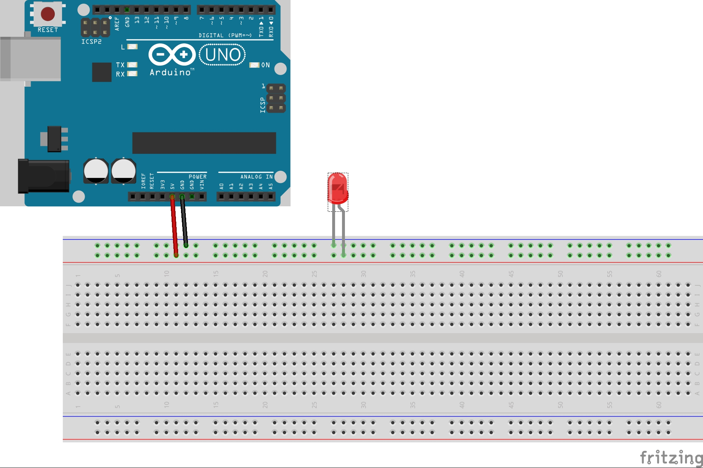

**Side note:** This is called a fritzing diagram. They’re super useful and way less confusing than traditional circuit diagrams: you can make your own using [the fritzing app](http://fritzing.org/download/).

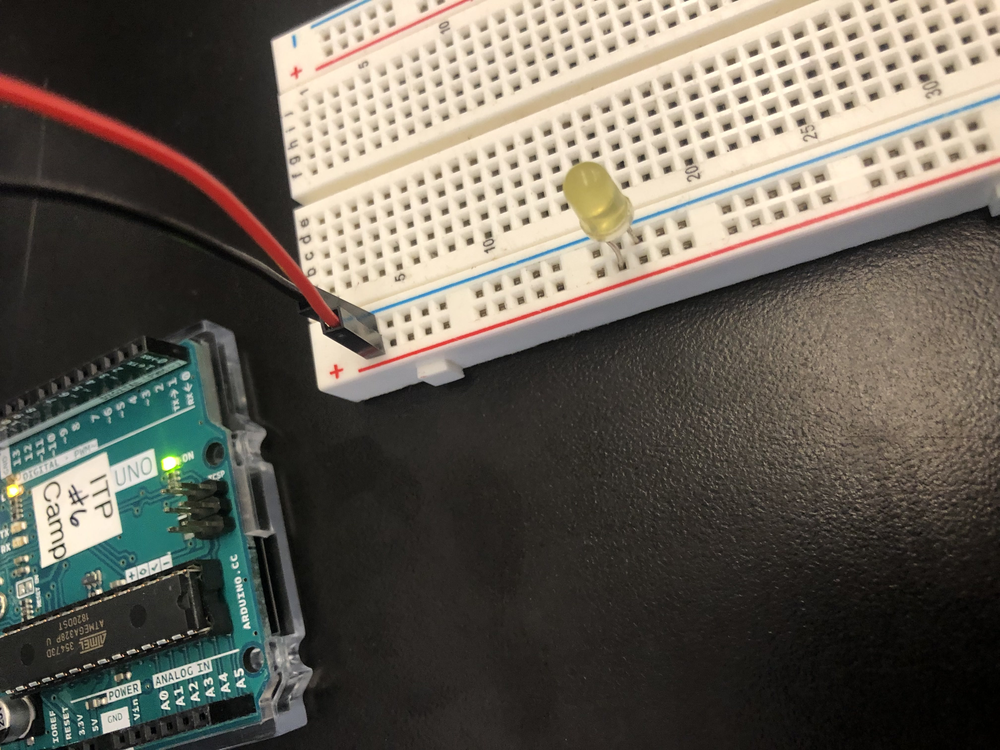

If we did this right, congrats! You just burned out your first LED. Why did this happen?

Current! The standard LEDs we’re using aren’t designed to function with the output current of an Arduino - they need a lower current to function without burning out. So now, we need to find a way to reduce our current so that our LEDs don’t burn.

### Adding a resistor

To make sure our LED gets the right current, we’ll add a component called a **resistor**: basically a little wire with some fancy stuff in it that provides extra resistance to our circuit. These guys are marked with little colored bands that actually can tell you what level of resistance (measured in Ohms) they provide - you can check out the chart below, or [this useful web calculator](https://www.digikey.com/en/resources/conversion-calculators/conversion-calculator-resistor-color-code-4-band).

**SIDE NOTE:** *If you forget the resistor codes or don't have internet to check the handy chart, you can [use your multimeter to measure resistance](https://learn.sparkfun.com/tutorials/how-to-use-a-multimeter/measuring-resistance) as well! For example, here’s me measuring a 220 ohm resistor: *

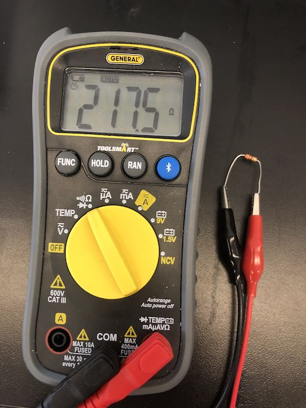

For most LEDs, a resistor between 220 and 1K ohms will do the job, so we’ll use a 220 ohm resistor for maximum brightness (to decrease brightness, we can use a higher-ohm resistor).

Basically, we want to put our resistor (in either direction - resistors aren’t polarized) in between our power supply and our LED. Since it’s a best practice to keep components on the horizontal rows on the breadboard, we’ll add red and black wires going from our power rails onto separate rows. We’ll need to get a new LED since we burned out our old one.

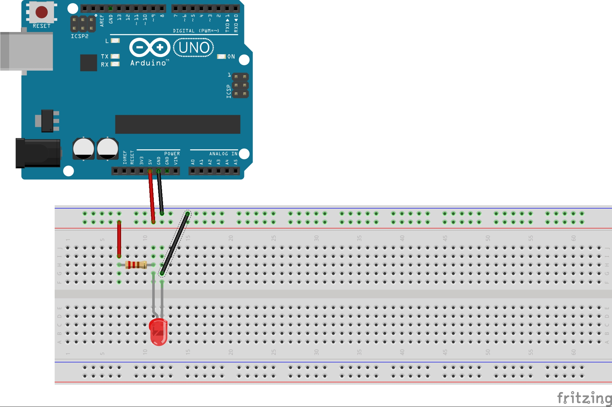

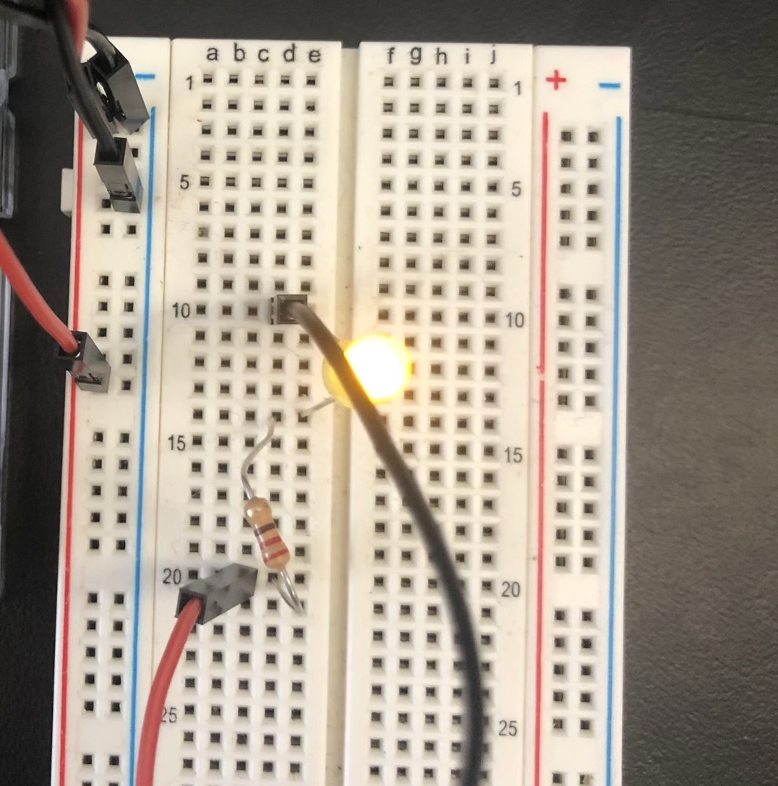

If we’ve wired this correctly, our LED should light up without burning out.

### Adding a pushbutton

Now, we’re going to add a pushbutton to our circuit. Pushbuttons (and switches, through lever action) are components that bring two pieces of metal together through pushing down. In the context of a circuit, this means if we run our current through a pushbutton, we can interrupt or restore it.

Basically, we want to run our power supply through one side of the pushbutton, then continue it on to the LED on the other side.
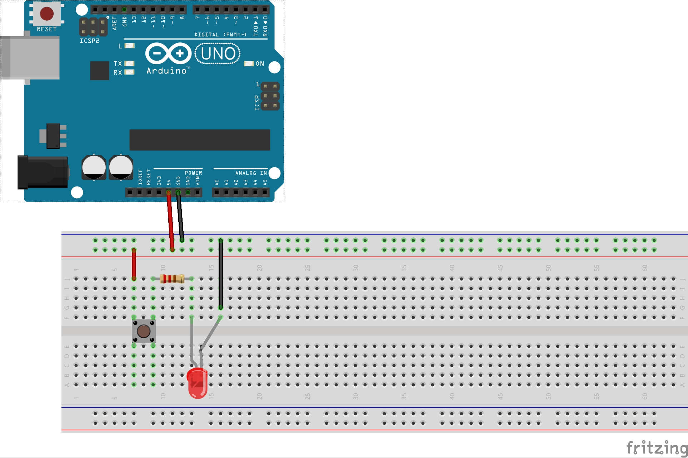

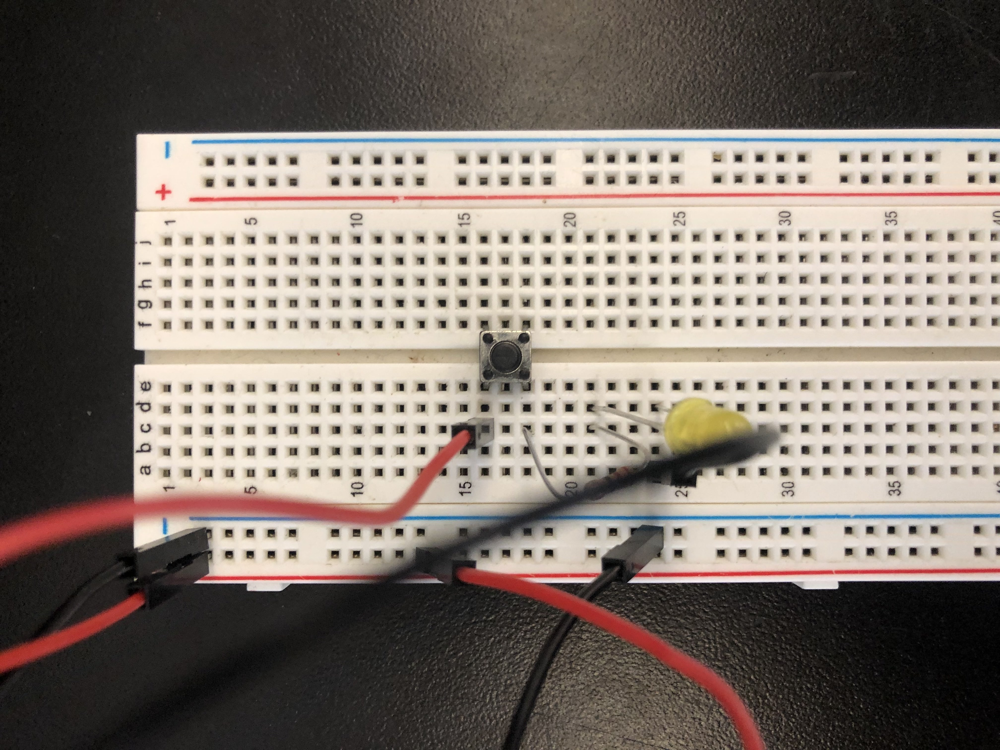

If we’ve wired this correctly, we should be able to turn our LED on and off.

### Adding a potentiometer

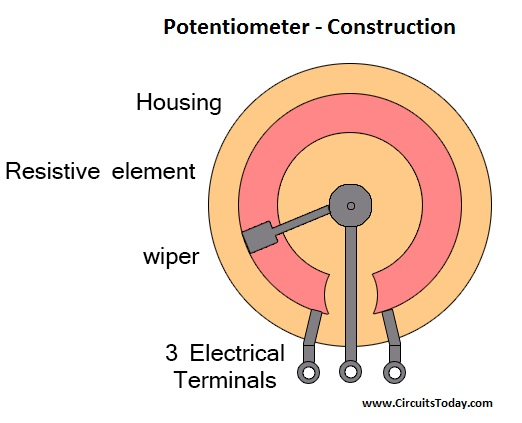

Now, let’s take switch out of our push button and add a potentiometer: this is a type of *variable resistor*. Variable resistors allow you to change their resistance as the current flows through them, in this case by turning a dial.

To do this correctly (at least on the potentiometers available in the ITP shop), we need to wire it so that it is attached to Ground, Power, and an output to our LED.

**SIDE NOTE:** *Why ground? Remember that ground is a reference for voltage. When we start using the Arduino later it's important to have this ground reference to get the correct sensor readings. This is outside the scope of this workshop so for now consider it a convention!*

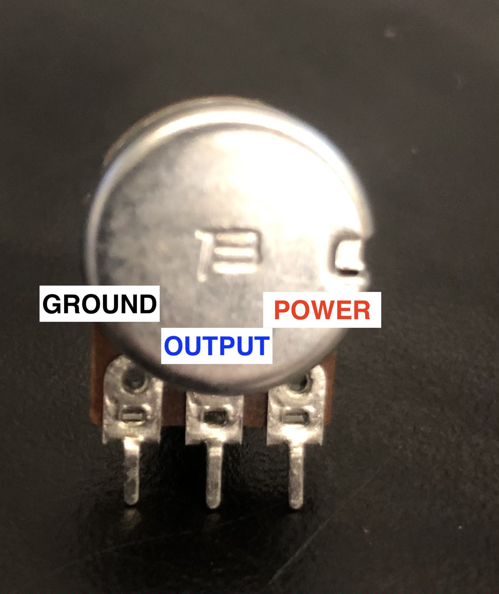

Let’s plug it into our breadboard, and wire it according to the diagram.

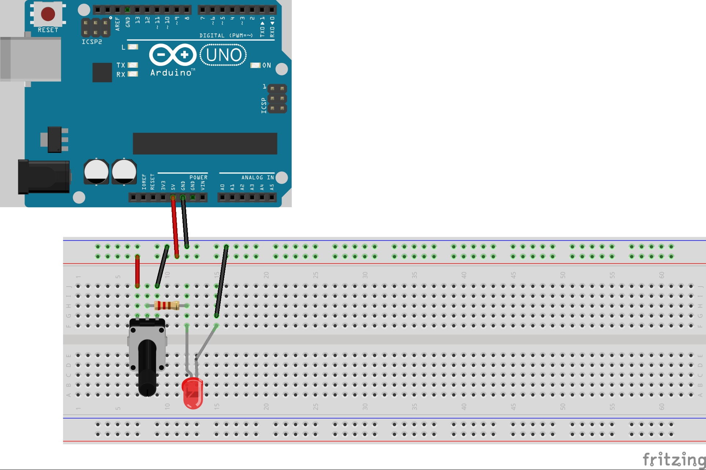

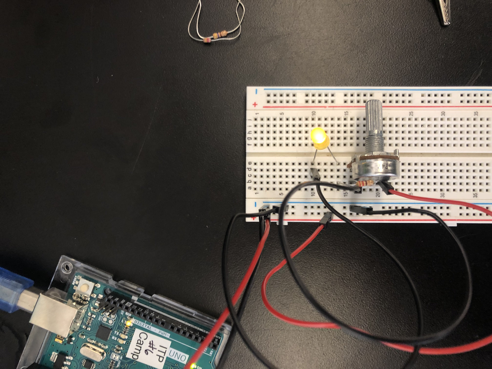

If this is wired correctly, we should be able to adjust the brightness of our LED!

### Capacitors

**Capacitors**: these store energy while it’s coming in, and then release it when incoming energy stops. These are super useful for making sure something that requires a very specific electrical supply receives it, as many power supplies tend to have dips and spikes in their current.

There’s not a great use for a capacitor in this circuit, but we’ll demo how it might be used live.

For more components, and their uses, you can check out [ITP’s components lab](https://itp.nyu.edu/physcomp/labs/labs-electronics/components/).

### More Useful Stuff

[The ITP Physical Computing Syllabus](https://itp.nyu.edu/physcomp/) - this has every lab, resource, and video taught in ITP’s required Physical Computing Course.

[Practical Electronics for Inventors](https://itp.nyu.edu/physcomp/) - a super useful book if you want to get deeper into electronics and circuit building. Usually taught at ITP under a variety of names.
